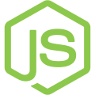

# TO-DO List

Interactive console application, with options that can be selected with the directional keys, numbers and the space key when there are multiple options.

Rebuild the node modules in case you want to use this app.

In the project directory run the following command:

```bash
npm install
```

## Requirements

It is necessary to have installed:

A source code editor such as [VSCode](https://code.visualstudio.com/), [Sublime Text](https://www.sublimetext.com/) or any other editor we like.

[](https://nodejs.org/es) [](https://www.npmjs.com/)

## Launch the application

In the project directory run the following command:

```bash
node app
```

## Install nodemon (optional)

nodemon is a tool that helps develop Node.js based applications by automatically restarting the node application when file changes in the directory are detected.

Install nodemon using your favorite package manager:

```bash
npm install -g nodemon
```

```bash
yarn global add nodemon
```

And nodemon will be installed globally to your system path.

In the project directory run the following command:

```bash
nodemon app
```

You can also install nodemon as a development dependency:

```bash
npm install --save-dev nodemon
```

```bash
yarn add nodemon -D
```

With a local installation, nodemon will not be available in your system path or you will not be able to use it directly from the command line. Instead, the local installation of nodemon can be run by calling it from within an npm script in the package.json file.

```json
"scripts": {
    "dev": "nodemon app"
}
```

In the project directory run the following command:

```bash
npm run dev
```

More information about nodemon is available at the following link [nodemon](https://www.npmjs.com/package/nodemon)

## Inquirer

Inquirer is a library that makes it easy to make CLI apps.

The interactive menu of the app is built with ```inquirer.js```

### Installation

```bash
npm i inquirer
```

More information about the inquirer is available at the following link [inquirer](https://www.npmjs.com/package/inquirer)

## License

[](https://choosealicense.com/licenses/mit/)
